# PowerDesk_PowerShell-Operations-Toolkit
PowerShell CLI Operations Toolkit for System\Network administrator, HelpDesk and automating scripts lovers.

comprehensive PowerShell toolkit designed to streamline operations for system administrators and help desk teams.

This script includes an extensive menu system with a wide array of commands to enhance productivity.
  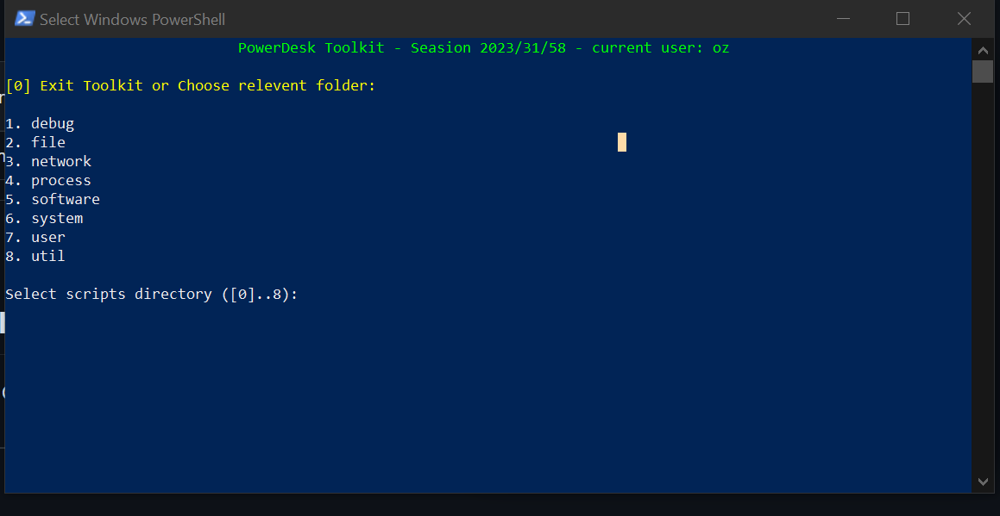

# 1. clone the repo
```bash
https://github.com/OzZaken/PowerDesk_PowerShell-Operations-Toolkit.git
```
# 2. Make sure Allow scripts in powershell by run the command 
```bash
Set-ExecutionPolicy ByPass
# or if on remote machine
Set-ExecutionPolicy RemoteSigned
```
# 3. add your username config user file  
```bash
config\CONTRIBUTERS.txt
# Or
config\POWERDESK_USERS.txt
```

# 4. Run with powershell index.ps1
  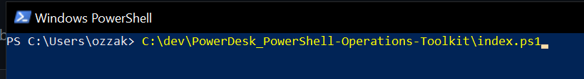

# PowerDesk ToolKit Menu keep simple

## For safety Guest and Regular users cant get into 'debug' directory and run unfinished scripts.    
  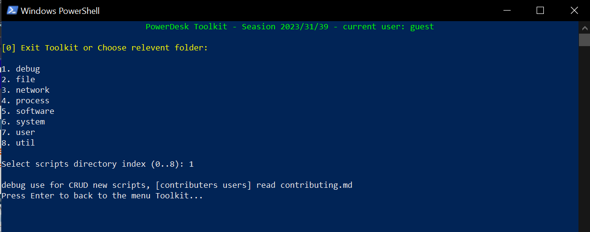


# CRUD Over Files
  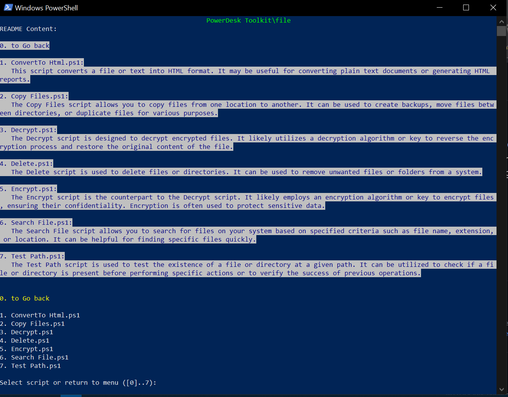

# Networks scripts
  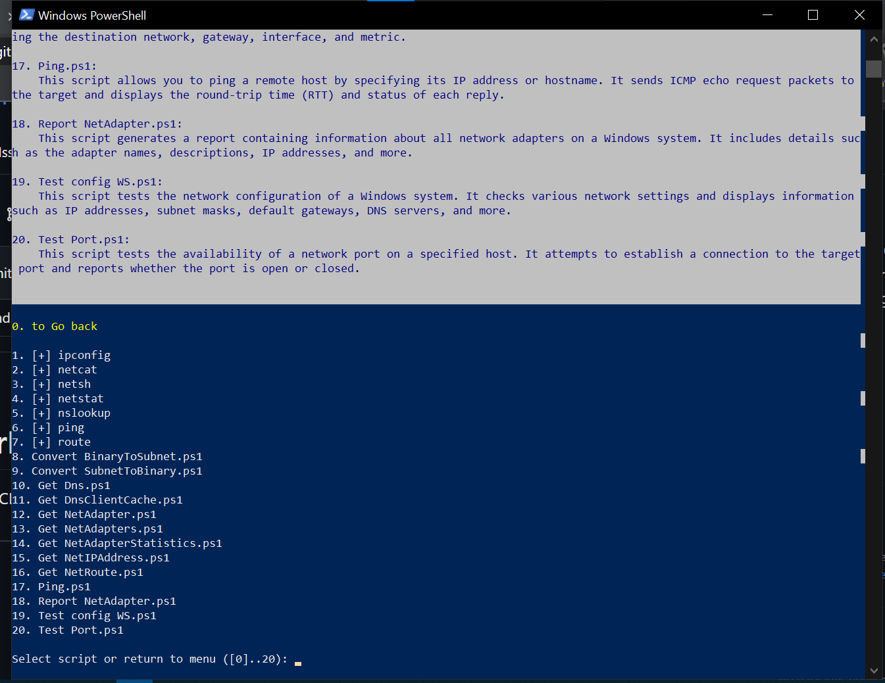

# Networks adapters report on html in second (script index 18): 
  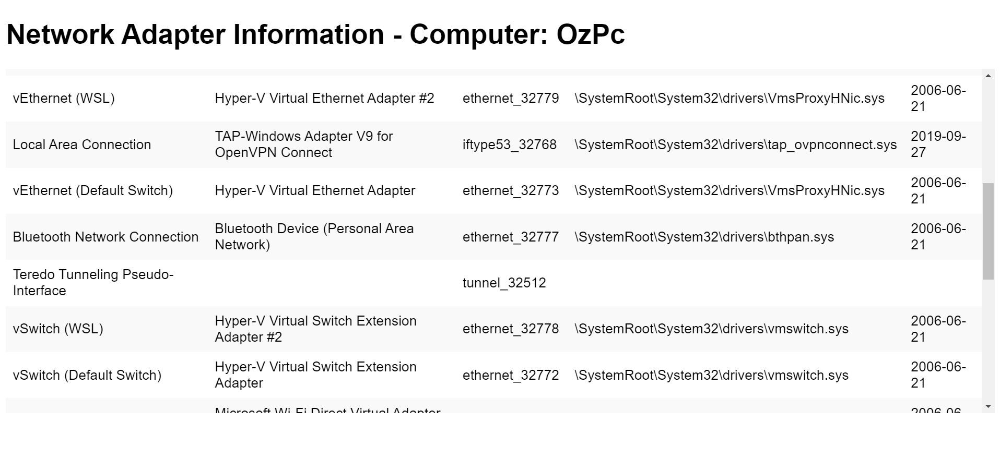

# System Menu: 
  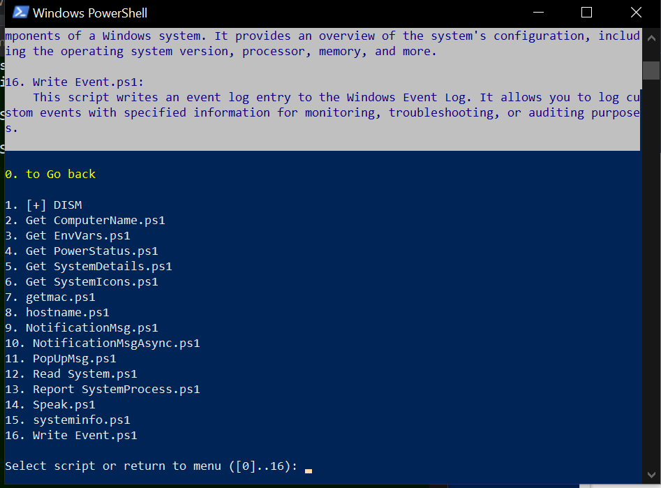

#  Two Version of Pop-ups on Two Version of Powershell: 
  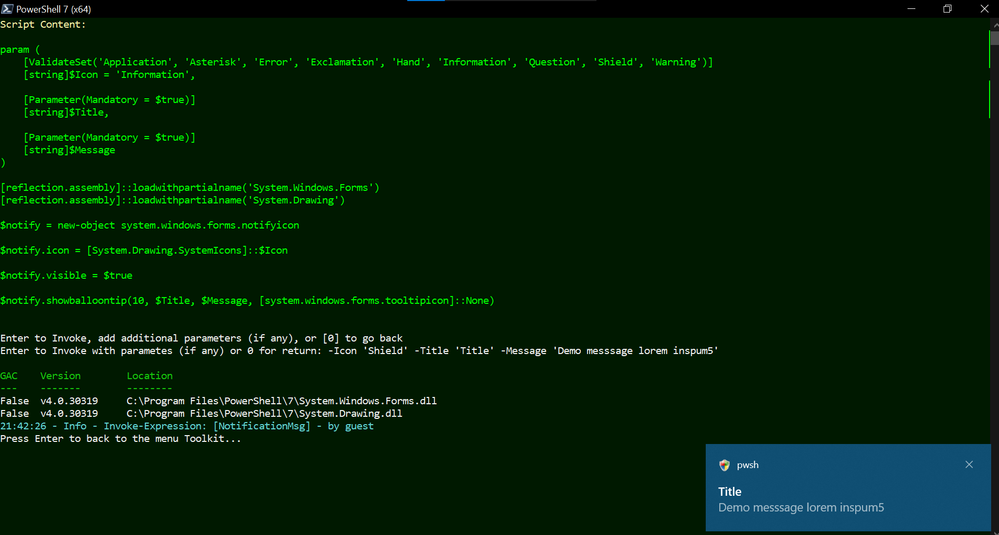
  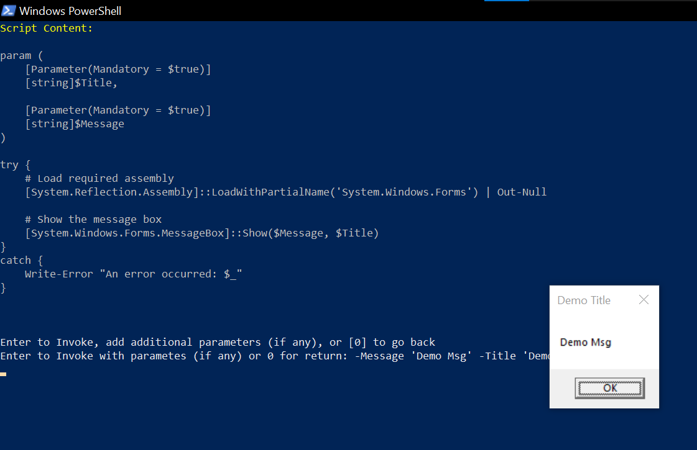

# 3 Versions of logs file for easy debugging (daily session, per script file, warning):    
  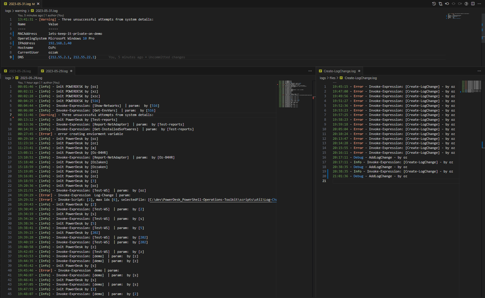

## Contributors can keep truck and Update the 'CHANGES.md' file  over logs via debug\contribute:
  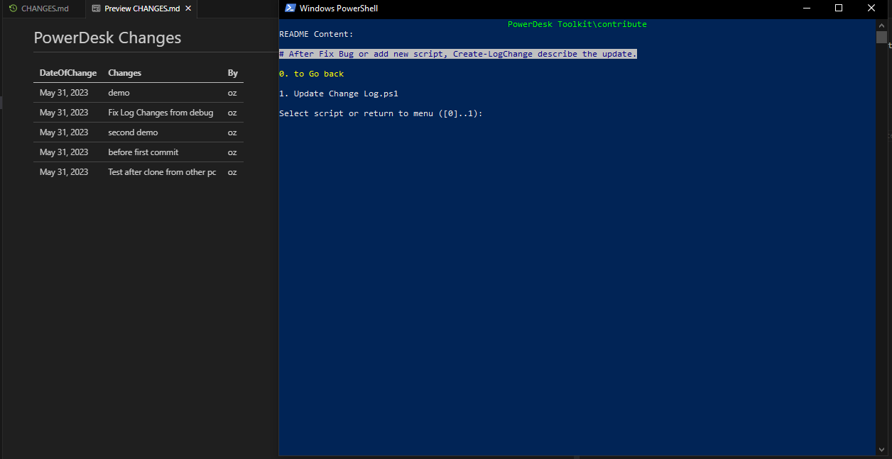
  
## Contributors? 
  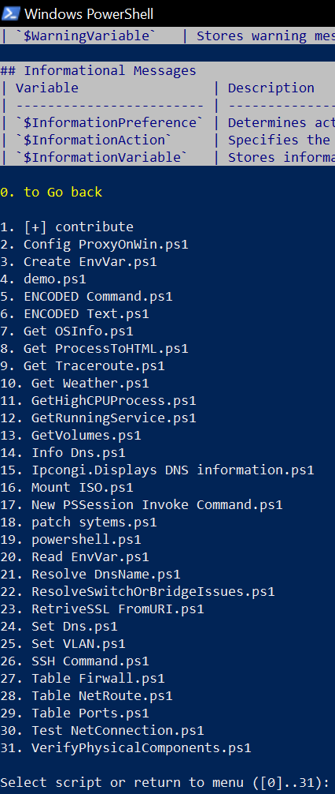
